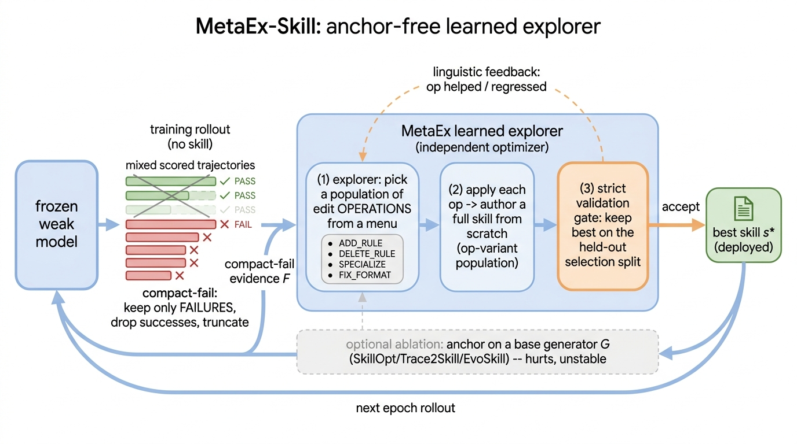
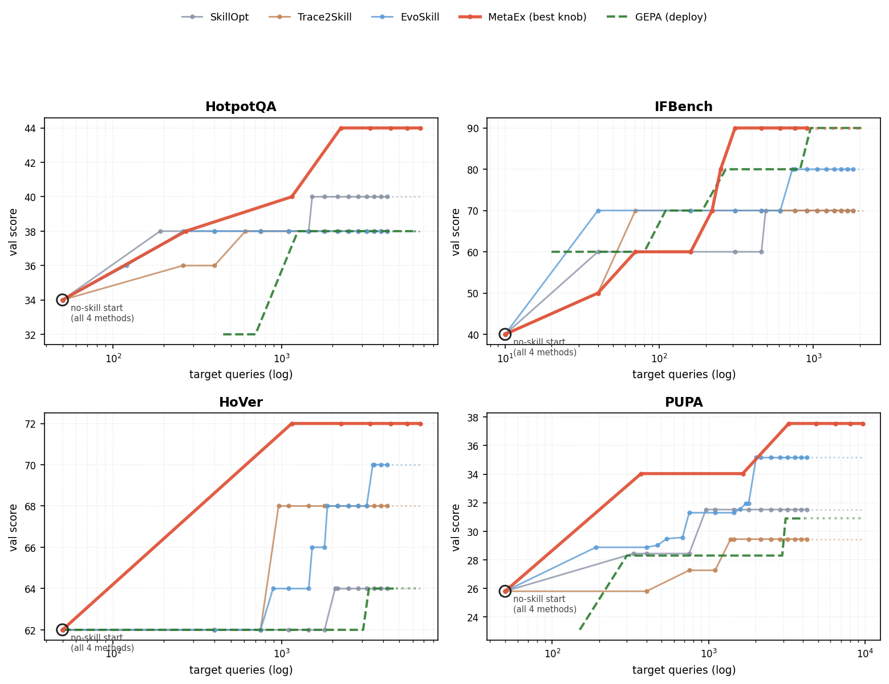

# MetaEx-Skill

An anchor-free **learned explorer** for text-space skill optimization on frozen language models.



**How it works.** Each round the frozen weak model runs the training tasks with *no skill* and
the harness scores every trajectory. We then form the **compact-fail** evidence *F*: only the
*failing* trajectories are kept (successes dropped) and compressed, so *F* is a dense record of
the recurring procedural errors. A frozen meta-controller—the *learned explorer*—reads *F* and
then:

1. **picks a population** of edit *operations* from an explicit op-menu (`ADD_RULE`,
   `SPECIALIZE`, `ADD_SANITY_CHECK`, `ADD_FORMATTING_RULE`, `DECOMPOSE`, `PRUNE`);
2. **authors a full skill from scratch** under each operation (an op-variant population);
3. **keeps the best** under a strict held-out selection gate.

The accepted skill seeds the next round, and each operation's verdict (*helped / regressed /
gate-rejected*) feeds a **linguistic feedback** history that steers the next round. The explorer
needs **no base generator to seed it**—*anchoring* it on one (SkillOpt / Trace2Skill / EvoSkill /
GEPA) inherits that base's selection noise and hurts, so the deployed method is anchor-free.

Under a matched target-query budget the explorer tops every benchmark, ahead of GEPA and every
skill baseline, and reaches its plateau at a fraction of GEPA's budget:



This repository contains the runners for the fully-reproducible open-weights experiments
(Qwen3-8B / Qwen3.6-35B-A3B on the DSPy harness).

## Setup

```bash
pip install -r requirements.txt          # dspy, litellm, datasets, huggingface_hub<0.35
cp .env.example .env                      # then edit OLLAMA_BASE to your endpoint
```

Serve the frozen target model on any OpenAI-compatible endpoint (e.g. [ollama](https://ollama.com)):

```bash
ollama pull qwen3:8b                       # or qwen3.6:35b-a3b for the 35B target
# ollama exposes an OpenAI-compatible API at http://localhost:11434/v1
```

Point `OLLAMA_BASE` in `.env` at that endpoint.

**Non-thinking is required and enforced in-code.** On the OpenAI-compatible `/v1` endpoint,
Qwen3/Qwen3.6 ignore the `reasoning.effort` parameter, so the runners disable thinking by
injecting a system-role `/no_think` message on every call (a small `dspy.LM.forward` wrapper at
the top of each script). Do not remove it: without it the target emits long reasoning that both
skews the scores and overflows `max_tokens`, breaking the structured-output parse.

**Raise the file-descriptor limit** before long runs: the DSPy/litellm client opens many
connections, and the default `ulimit -n 1024` can exhaust mid-run (eval calls then fail and
silently score `0`). Prefix long jobs with `ulimit -n 65536`.

## Datasets (open-model experiments)

The four public benchmarks below are **downloaded automatically** the first time a runner
touches them—no manual preparation needed:

| Benchmark | Source | Loader |
|---|---|---|
| **HotpotQA** | DSPy built-in | `dspy.datasets.HotPotQA` |
| **IFBench**  | Hugging Face | `datasets.load_dataset(...)` |
| **HoVer**    | Hugging Face `hover-nlp/hover` | `datasets.load_dataset(..., trust_remote_code=True)` |
| **PUPA**     | Hugging Face `Columbia-NLP/PUPA` (`pupa_new`) | `datasets.load_dataset(...)` |

All splits use `seed=42` (train ~150 / val ~50). The first HuggingFace pull may need
`huggingface_hub<0.35` (pinned in `requirements.txt`) for the older dataset ids.

## Running

```bash
# Iterative refinement, one method at a time (bench, method, rounds):
python gepa_refine.py hotpotqa skillopt 30
python gepa_refine.py pupa explorer_na 30         # methods below

# MetaEx op-menu population sweep (bench, M_pop, feedback_mode, rounds):
python gepa_metaex_ablation_grid.py hotpotqa 4 fail 30
#   M_pop in {1,2,4,6} (capped at the 6-op menu); mode in {full,fail,success,both}

# Anchor ablation — condition the explorer on a base generator's seed skill:
python gepa_metaex_anchor.py hotpotqa 4 fail 30 gepa   # anchor in {none,evoseed,skillopt,trace2skill,gepa}

# Cross-model transfer — apply an authored skill zero-shot to another frozen target:
SKILLS_DIR=./skills python gepa_transfer.py pupa ./skills/pupa_metaex.md   # weak->strong (8B skill -> 35B target)
python gepa_transfer_8btarget.py pupa ./skills/pupa_metaex.md              # strong->weak (35B skill -> 8B target)
```

`gepa_transfer.py` evaluates a skill on the 35B target; `gepa_transfer_8btarget.py` is the
reverse direction (35B-authored skill applied to the 8B target). Pass `NOSKILL` as the skill
path for the no-skill baseline. Authored skills are saved to `SKILLS_DIR` (default `./skills`).

## Baselines (all methods, one command each)

Every competing method runs through the **same** iterative-refinement loop, harness, target
model, and matched budget as our explorer—only the proposal step differs. These are our
**faithful in-harness re-implementations** (each captures the method's published proposal
mechanism), not the original authors' code, so all methods are compared on identical footing.
Pass the method name to `gepa_refine.py`:

| Method | `method` arg | Proposal step |
|---|---|---|
| No-skill | *(run with the empty skill)* | none |
| One-shot | `oneshot` | author one skill from examples, deploy ungated |
| SkillOpt | `skillopt` | reflect on a failure minibatch → consolidated add/delete/replace edits |
| Trace2Skill | `trace2skill` | distill trajectory-level lessons |
| EvoSkill | `evoseed` | seed-evolution refinement under rotating lenses |
| GEPA | `gepa` | reflective evolution from a base prompt |
| **MetaEx (ours)** | `explorer_na` | learned op-menu population + linguistic feedback (anchor-free) |

```bash
for m in oneshot skillopt trace2skill evoseed gepa explorer_na; do
  python gepa_refine.py hotpotqa $m 30
done
```

`gepa_metaex_ablation_grid.py` runs the MetaEx op-menu **population** variant (`M_pop` and
feedback-mode sweep); `gepa_metaex_anchor.py` runs the **anchored** ablation
`MetaEx∘G` (seed the explorer on any base generator `G`).

## Closed-model benchmarks (separate harness)

The paper also reports a broad closed-model validation on six benchmarks spanning direct-chat,
tool-use, vision, and embodied harnesses. **Those harnesses are not included in this
repository** (they wrap tool loops, image inputs, and a TextWorld environment). Their public
data sources are listed for reference:

| Benchmark | Task / harness | Source |
|---|---|---|
| **SearchQA** | extractive QA, single-round | Dunn et al., 2017 |
| **SpreadsheetBench** | cell edits, tool-loop | Ma et al., 2024 |
| **LiveMathematicianBench** | research-level math MCQ | 2026 |
| **DocVQA** | document VQA, vision | Mathew et al., 2021 |
| **OfficeQA Pro** | numeric grounded reasoning | 2026 |
| **ALFWorld** | embodied multi-step (TextWorld) | Shridhar et al., 2020 |

See the paper appendix for the closed-model protocol and per-benchmark configuration.
